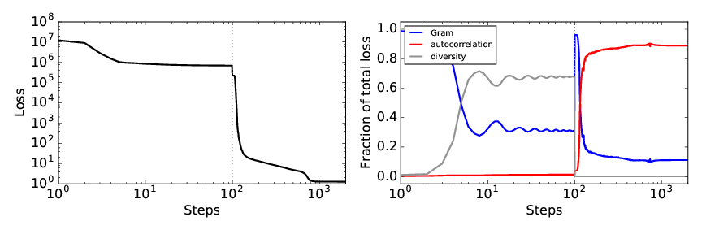

[Main page](README.md)

# Audio textures

## Additional figures

### Avoiding instability in the diversity term

The overall loss and the relative contributions of the three components during
optimization of a wind chimes texture using the diversity term from Sendik &
Cohen-Or (2017) compared to the diversity term in our paper.  Their diversity
term can lead to negative losses, which in turn makes optimization difficult
when the loss passes through zero.  In part to avoid these instabilities we
propose a new diversity term of the form Eq. 7 in our paper.

### Loss during optimization

Left panel: loss during optimization of the wind chimes texture.  Right panel:
the fraction of the total loss each of the three terms contributes during
optimization.

### Matching the autocorrelation function

Autocorrelation functions of a rhythmic (top row) and non-rhythmic (bottom row)
texture for the original (left column) and two weights on the autocorrelation
loss.  Whereas the non-rhythmic texture has a flat autocorrelation function, the
autocorrelation function of the rhythmic texture displays structure that is
reproduced only when the weight on the autocorrelation loss is large.
